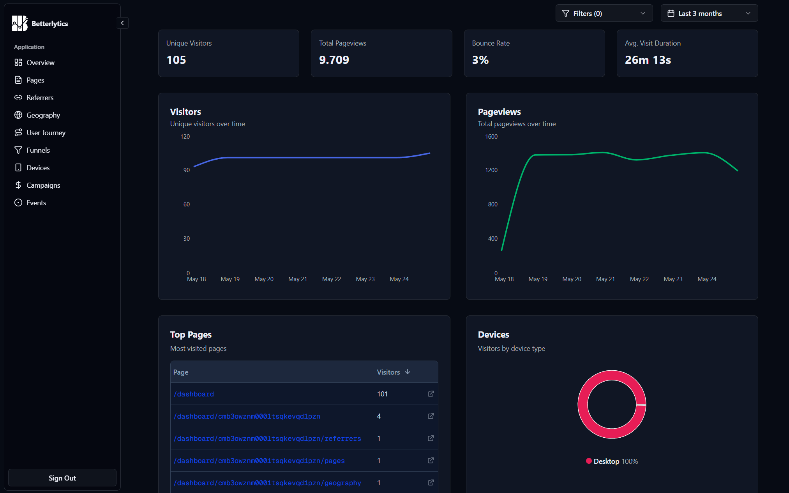
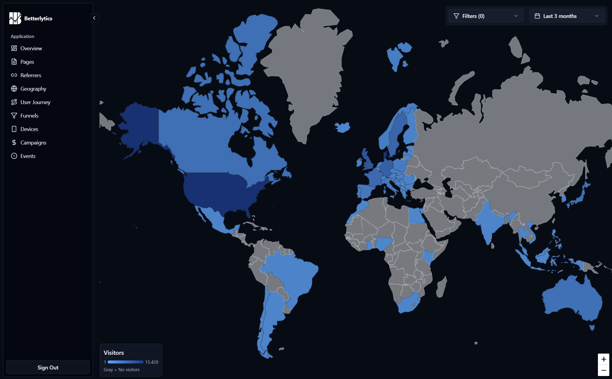
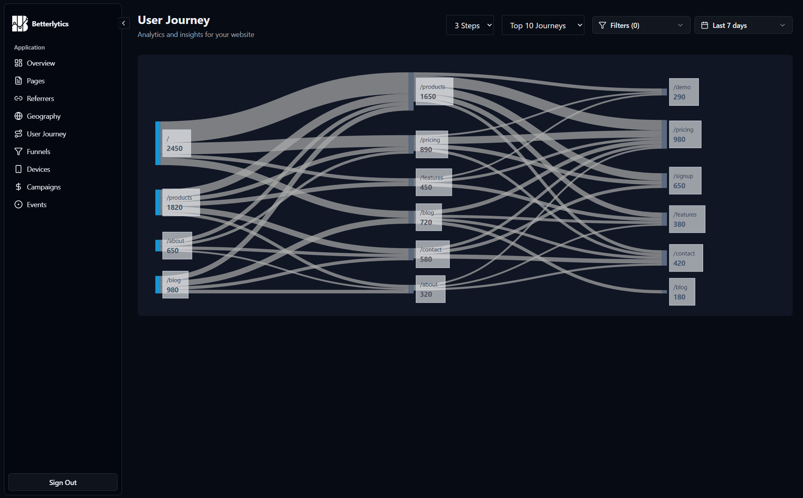
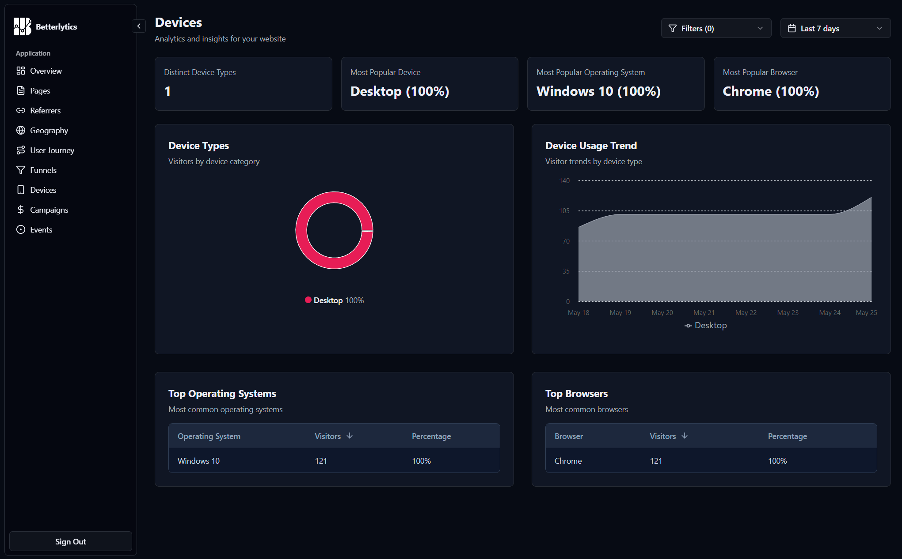
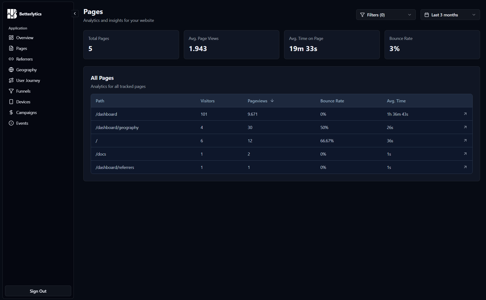

# Betterlytics

**A modern, Cookieless & privacy-focused analytics platform built for the future**

   

  

[🚀 Quick Start](#getting-started) • [📖 Documentation](#project-structure) • [🤝 Contributing](#contributing) • [📄 License](#license)

---

## 🌟 Why Betterlytics?

Betterlytics is a **high-performance, privacy-first** analytics platform that puts you in control of your data. Built with modern technologies like Rust and ClickHouse, it delivers lightning-fast insights while respecting user privacy.

**Our core principles:**

- 🔒 **Privacy-First**: GDPR, CCPA, and PECR compliant with no third-party tracking
- 🍪 **Cookieless**: No cookies required, respects user privacy
- ⚡ **Lightning Fast**: Built on Rust and ClickHouse for maximum performance
- 📊 **Real-time Insights**: Live dashboard with instant data updates
- 🎯 **Lightweight Tracking**: Minimal impact on your website's performance
- 🔧 **Self-Hosted**: Complete control over your data and infrastructure
- 📱 **Modern UI**: Beautiful, responsive dashboard built with Next.js 15 and React 19
- 🚀 **Scalable**: Handles millions of events with ease
- 🛠️ **Developer Friendly**: Easy to deploy, customize, and extend

### 🚀 Complete Feature Set

#### 📊 Core Analytics
| Feature | Description |
|---------|-------------|
| **Real-time Dashboard** | Live visitor tracking with instant updates powered by Clickhouse |
| **Page Analytics** | Detailed page views, bounce rates, and engagement metrics |
| **Referrer Tracking** | Complete referral source analysis and traffic attribution |
| **Geographic Insights** | Global visitor mapping with MaxMind GeoIP integration |
| **Device & Browser Detection** | Comprehensive device, OS, and browser analytics |
| **Campaign Tracking** | UTM parameter tracking and marketing campaign analysis |
| **Advanced Filtering** | Filter data across numerous dimensions and time ranges |
| **User Journey Mapping** | Visualize complete user paths through your site |
| **Conversion Funnels** | Track multi-step conversion processes and drop-off points |
| **Custom Events** | Track any custom interactions and business metrics |
| **Real-time Visitor Feed** | See live visitor activity as it happens |

#### 🛠️ Platform & Integration
| Feature | Description |
|---------|-------------|
| **Modern UI** | Beautiful dashboard built with Next.js 15, React 19, and Tailwind CSS |
| **Lightweight Script** | Minimal tracking script with zero performance impact |
| **SPA Support** | Full support for Single Page Applications and client-side routing |
| **Easy Integration** | Simple one-line script installation |
| **Docker Deployment** | One-command deployment with Docker Compose |
| **Performance Optimized** | Built on ClickHouse for sub-second query responses |

## 🚀 Getting Started

Choose the option that works best for you:

<table>
<tr>
<td width="50%" valign="top">

### ☁️ Cloud Hosting (Recommended)

Get started instantly with our free managed cloud service:

**[Start Free →](https://betterlytics.com/signup)**

- ✅ **Free forever plan** - No trial, genuinely free for small sites
- ✅ **No setup required** - Ready in 30 seconds
- ✅ **EU infrastructure** - All data processed on EU-owned cloud infrastructure
- ✅ **Automatic updates** - Always latest features
- ✅ **Managed infrastructure** - We handle scaling and maintenance
- ✅ **99.9% uptime** - Enterprise-grade reliability
- ✅ **Premium support** - Get help from our expert team
- ✅ **Automatic backups** - Your data is safe and recoverable
- ✅ **Paid plans available** - Scale up when you need more

</td>
<td width="50%" valign="top">

### 🏠 Self-Hosting

Run Betterlytics on your own infrastructure for complete control and privacy.

**[Quick Setup Guide →](SETUP.md#quick-setup)**

- ✅ **Complete privacy** - Your data never leaves your servers
- ✅ **Full control** - Customize everything to your needs
- ✅ **No fees to us** - Your money goes to infrastructure providers
- ⚠️ **You manage everything** - Installation, maintenance, upgrades, security
- ⚠️ **Your responsibility** - Server capacity, uptime, backups, loading times
- ⚠️ **Infrastructure costs** - Server, CDN, backups, and associated costs

📖 **[Setup Guide](SETUP.md#quick-setup)** | 🐳 **[Docker Setup](SETUP.md#docker-setup)** | 🛠️ **[Development](CONTRIBUTING.md)**

</td>
</tr>
</table>

---

## 📸 Dashboard Preview

### Overview

### Geography Insights

### User Journey Diagram

### Devices Breakdown

### Pages Breakdown

... and much more

## ⚡ Performance Benchmarks

Betterlytics is built for speed. Here's how it performs:

### Request Handling
| Metric | Value | Notes |
|--------|-------|-------|
| **Requests/Second** | 25,000+ | Single instance, standard hardware |
| **Response Time** | <5ms | P95 for tracking requests |
| **Memory Usage** | x | Rust backend at steady state |
| **CPU Usage** | x | During normal operation |

### Query Performance
| Query Type | Response Time | Dataset Size |
|------------|---------------|--------------|
| **Overview Page** | x | 1M+ events |
| **Page Analytics** | x | 10M+ events |
| **User-Journey** | x | 100M+ events |
| **Geographic Data** | x | Global dataset |

### Scalability
- **Events/Day**: Tested up to xM+ events
- **Concurrent Users**: 1,000+ dashboard users
- **Data Retention**: Unlimited (depends on storage)
- **Geographic Distribution**: Multi-region support

> 📊 **Benchmarks performed on**: 4-core CPU, 8GB RAM, SSD storage  
> 🔄 **Last updated**: [Date to be added]  

## 🗺️ Roadmap

We're constantly working to improve Betterlytics. Here's what's coming next:

<table>
<tr>
<td width="50%" valign="top">

### 🚧 In Development

| Feature | Description |
|---------|-------------|
| 🔌 **REST API** | Full API access for custom integrations and data export |
| ☁️ **Cloud Hosting** | Managed hosting option for easy deployment |

</td>
<td width="50%" valign="top">

### 🎯 Planned Features

| Feature | Description |
|---------|-------------|
| 🔔 **Alerts & Notifications** | Custom alerts for traffic spikes and anomalies |
| 📊 **Advanced Reporting** | Scheduled reports and custom dashboards |
| 🔗 **Integrations** | Connect with popular tools (Slack, Discord, Webhooks) |
| 📈 **A/B Testing** | Built-in experimentation platform |
| 🤖 **AI Insights** | Automated insights and recommendations |

</td>
</tr>
</table>

## 💡 Ideas & Suggestions
Have an idea for Betterlytics? We'd love to hear it! 
- Open an [issue](https://github.com/Lindharden/better-analytics/issues) to suggest new features
- Join our discussions to share your thoughts
- Contribute code to help us build these features faster

---

## 👥 Community

Join our small community of developers and privacy advocates:

- 💬 **[Discord](https://discord.gg/betterlytics)** - Get help, share ideas, and connect with other users and developers
- 🦋 **[Bluesky](https://bsky.app/profile/betterlytics.bsky.social)** - Follow us for updates and announcements
- 🐛 **[GitHub Issues](https://github.com/Lindharden/better-analytics/issues)** - Report bugs and request features
- 💡 **[GitHub Discussions](https://github.com/Lindharden/better-analytics/discussions)** - Ask questions and share feedback